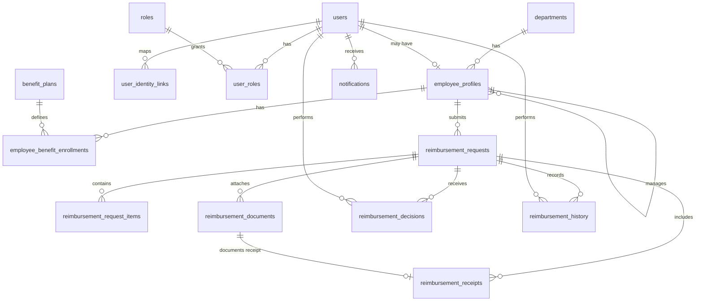

# Data Model

## Purpose
Define the core business objects needed to support the current reimbursement use cases, rules, dashboards, approvals, and reports.

## Source Inputs
- `docs/02-use-cases/*`
- `docs/03-rules-and-logic/*`
- `BUSINESS_REQUIREMENTS.md`
- Current mock data in `src/app/components/EmployeeDashboard.tsx`, `AdminDashboard.tsx`, `LineManagerDashboard.tsx`, `ReimbursementForm.tsx`, and `OpticalReimbursementForm.tsx`

## Modeling Decisions

### External Authentication, Internal Authorization
QAT authentication will use Supabase Auth. The later internal-site version will authenticate through Windows Active Directory. The application data model keeps an internal `users` record for authorization, ownership, audit, and notifications, then links that user to the current authentication provider through `user_identity_links`. This prevents reimbursement, decision, and audit records from depending directly on Supabase-specific or Active Directory-specific identifiers.

### Unified Request Model
Medicine and optical claims share the same lifecycle, document requirements, line-item structure, balance behavior, and review surfaces. The data model uses one `reimbursement_requests` entity with a `category` field instead of separate medicine and optical request tables.

### Generic Line Items
The current UI names medicine entries and optical entries differently, but both collect item name, quantity, unit price, and subtotal. The data model uses `reimbursement_request_items` so the same structure supports medicines, eyeglasses, contact lenses, optical services, and future reimbursable item types.

### Documents as First-Class Records
The rules allow multiple prescription files and multiple receipt files per request. Documents are modeled separately from requests so each file can carry its own type, metadata, review access, and storage location.

### Receipt Metadata Separate From File Metadata
Receipt-specific facts such as invoice number and PWD deductions belong to `reimbursement_receipts`. The uploaded receipt file itself belongs to `reimbursement_documents`. This keeps file storage concerns separate from claim calculation concerns.

### Review Decisions as Events
Admin and line-manager decisions are modeled as `reimbursement_decisions` records. This supports the current mockup and keeps the model flexible while open workflow questions remain unresolved.

## Entity Overview

| Entity | Purpose | Primary Relationships |
| --- | --- | --- |
| `users` | Internal application user used for authorization, ownership, audit, and notifications. | Belongs to one `employee_profile` when the user is an employee. |
| `user_identity_links` | Mapping between an internal user and an external identity provider account. | Belongs to one user and one provider subject. |
| `roles` | Role definitions such as Employee, Admin, and Line Manager. | Assigned to users through `user_roles`. |
| `departments` | Supported organization departments. | Has many employee profiles and report aggregates. |
| `employee_profiles` | Employment data used for dashboards, scope, and claims. | Belongs to a department and may report to a line manager. |
| `benefit_plans` | Annual benefit limits by category. | Assigned through `employee_benefit_enrollments`. |
| `employee_benefit_enrollments` | Employee-specific annual benefit entitlement. | Connects employee, benefit category, limit, and plan year. |
| `reimbursement_requests` | Claim header containing employee, category, status, dates, and totals. | Has many items, documents, receipts, decisions, and history events. |
| `reimbursement_request_items` | Medicine or optical item lines. | Belongs to one reimbursement request. |
| `reimbursement_documents` | Uploaded prescription and receipt files. | Belongs to one reimbursement request and may be linked to one receipt. |
| `reimbursement_receipts` | Receipt metadata, invoice numbers, and PWD deductions. | Belongs to one reimbursement request and one receipt document. |
| `reimbursement_decisions` | Admin or line-manager approval, denial, or decline events. | Belongs to one request and one actor user. |
| `reimbursement_history` | Audit trail for submission, status changes, and key updates. | Belongs to one request and one actor user. |
| `notifications` | In-app or future email messages triggered by system events. | Belongs to one recipient user and optionally one request. |

## Relationship Diagram



## Core Entities

### User
Represents a person inside the application. Authentication is delegated to an external identity provider, but reimbursement records reference this internal user so provider migration does not rewrite business data.

Key attributes:
- `user_id`
- `email`
- `display_name`
- `status`
- `last_login_at`

Rules supported:
- ACL-001 through ACL-007
- NOTIF-001

### User Identity Link
Maps an internal application user to the identity provider account used to sign in.

Key attributes:
- `user_identity_link_id`
- `user_id`
- `identity_provider`
- `external_subject`
- `external_email`
- `external_username`
- `linked_at`
- `last_seen_at`

Initial provider values:
- `supabase`
- `active_directory`

QAT behavior:
- Supabase Auth owns credential validation and session issuance.
- The app resolves the Supabase authenticated user subject to an internal `users.user_id` through this entity.

Internal-site behavior:
- Windows Active Directory becomes the authentication source.
- The app links the AD object identifier, SID, UPN, or other selected immutable directory subject to the same internal user.

Rules supported:
- ACL-001
- ACL-007
- NFR-008
- NFR-009

### Role
Defines portal and permission groups.

Initial values:
- `employee`
- `admin`
- `line_manager`

Rules supported:
- ACL-001 through ACL-006

### Department
Represents the fixed reporting departments used by filters and charts.

Initial values:
- Product Development
- Finance
- HR
- Admin
- IT Helpdesk

Rules supported:
- RPT-003
- RPT-004
- ACL-006

### Employee Profile
Stores employee-specific profile data visible in dashboards and used for request ownership.

Key attributes:
- `employee_profile_id`
- `user_id`
- `employee_number`
- `full_name`
- `designation`
- `department_id`
- `line_manager_employee_profile_id`
- `employment_status`

Rules supported:
- ELIG-005
- ACL-003
- ACL-006

### Benefit Plan
Defines category limits. Current use cases require separate Medicine and Optical balances.

Key attributes:
- `benefit_plan_id`
- `category`
- `annual_limit`
- `currency`
- `effective_from`
- `effective_to`

Initial category values:
- `medicine`
- `optical`

Rules supported:
- BAL-001
- BAL-005
- BAL-007

### Employee Benefit Enrollment
Stores an employee's limit for a category and plan year.

Key attributes:
- `employee_benefit_enrollment_id`
- `employee_profile_id`
- `benefit_plan_id`
- `plan_year`
- `annual_limit_override`

Rules supported:
- BAL-001 through BAL-007

### Reimbursement Request
The claim header and lifecycle record.

Key attributes:
- `reimbursement_request_id`
- `request_number`
- `employee_profile_id`
- `category`
- `status`
- `submitted_at`
- `item_subtotal_amount`
- `pwd_deduction_amount`
- `claim_amount`
- `notes`
- `employee_confirmed_at`

Status values:
- `draft`
- `pending`
- `approved`
- `denied`
- `declined`
- `cancelled`

Rules supported:
- ELIG-001 through ELIG-007
- STAT-001 through STAT-008
- WF-001 through WF-011
- RPT-001 through RPT-007

### Reimbursement Request Item
An item being claimed.

Key attributes:
- `reimbursement_request_item_id`
- `reimbursement_request_id`
- `item_name`
- `quantity`
- `unit_price`
- `subtotal_amount`
- `sequence_number`

Rules supported:
- VAL-001 through VAL-006

### Reimbursement Document
An uploaded file attached to a request.

Document type values:
- `prescription`
- `receipt`

Key attributes:
- `reimbursement_document_id`
- `reimbursement_request_id`
- `document_type`
- `file_name`
- `mime_type`
- `file_size_bytes`
- `storage_url`
- `uploaded_by_user_id`
- `uploaded_at`

Rules supported:
- DOC-001 through DOC-010
- VAL-007 through VAL-010
- VAL-015 through VAL-016

### Reimbursement Receipt
Receipt-specific review and calculation metadata.

Key attributes:
- `reimbursement_receipt_id`
- `reimbursement_request_id`
- `receipt_document_id`
- `invoice_number`
- `is_pwd`
- `vat_exemption_amount`
- `pwd_discount_amount`
- `sequence_number`

Rules supported:
- DOC-003 through DOC-005
- VAL-009 through VAL-011
- BRD PWD benefit rules

### Reimbursement Decision
Records each review decision without assuming a final multi-step workflow design.

Decision type values:
- `approve`
- `deny`
- `decline`

Review stage values:
- `line_manager`
- `admin`
- `finance`

Key attributes:
- `reimbursement_decision_id`
- `reimbursement_request_id`
- `review_stage`
- `decision_type`
- `decision_reason_code`
- `decision_reason_text`
- `decided_by_user_id`
- `decided_at`

Rules supported:
- WF-002 through WF-011
- VAL-013 through VAL-014
- NOTIF-005 through NOTIF-007

### Reimbursement History
Immutable audit events for request submission and state changes.

Key attributes:
- `reimbursement_history_id`
- `reimbursement_request_id`
- `event_type`
- `previous_status`
- `new_status`
- `performed_by_user_id`
- `event_note`
- `created_at`

Rules supported:
- WF-010
- WF-011

### Notification
Tracks in-app notifications and supports future email delivery.

Key attributes:
- `notification_id`
- `recipient_user_id`
- `reimbursement_request_id`
- `notification_type`
- `title`
- `message`
- `delivery_channel`
- `read_at`
- `created_at`

Rules supported:
- NOTIF-001 through NOTIF-007

## Derived Data

### Benefit Usage
Remaining balance is derived, not stored as the source of truth.

Formula:
```text
remaining_balance =
  annual_limit_for_employee_category_year
  - sum(approved reimbursement_requests.claim_amount for same employee, category, and plan year)
```

Pending, denied, and declined requests do not reduce balance.

### Request Total
Claim amount is calculated from line items and receipt deductions.

Formula:
```text
item_subtotal_amount = sum(reimbursement_request_items.subtotal_amount)
pwd_deduction_amount = sum(reimbursement_receipts.vat_exemption_amount + reimbursement_receipts.pwd_discount_amount)
claim_amount = item_subtotal_amount - pwd_deduction_amount
```

### Dashboard and Reporting Metrics
Admin and line-manager reporting should be derived from request, employee, department, decision, and status data instead of stored as independent source records.

Examples:
- Count by category and status
- Approved totals by department and category
- Pending amount by line-manager queue
- Oldest pending request by employee
- High-value pending claims

## Open Modeling Questions
- Should `denied` and `declined` remain separate global statuses, or should they become role-specific decision labels under one rejected status?
- Is line-manager approval a mandatory step before admin approval, or an alternate review path?
- Should Finance become a separate role and review stage before payment processing?
- Should request edits, withdrawals, and resubmissions be supported after denial or decline?
- Should benefit years use calendar year, fiscal year, or employee anniversary?
- Which Active Directory identifier will be treated as immutable for migration: object GUID, SID, UPN, employee number, or another claim?
